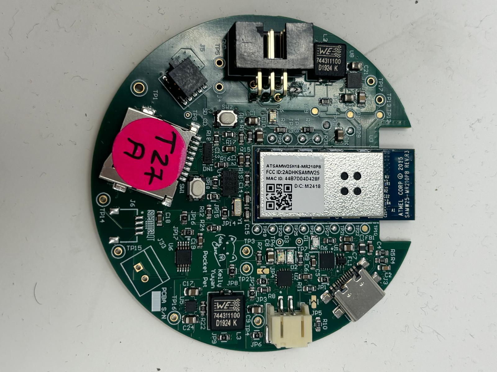
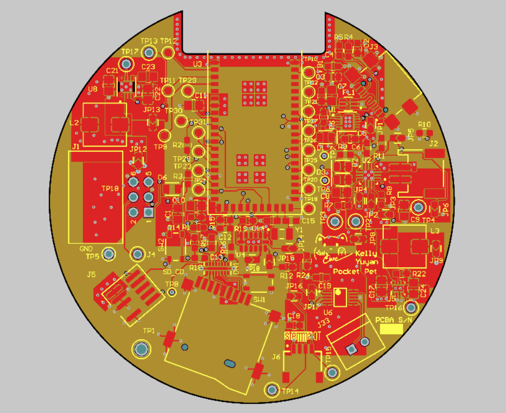
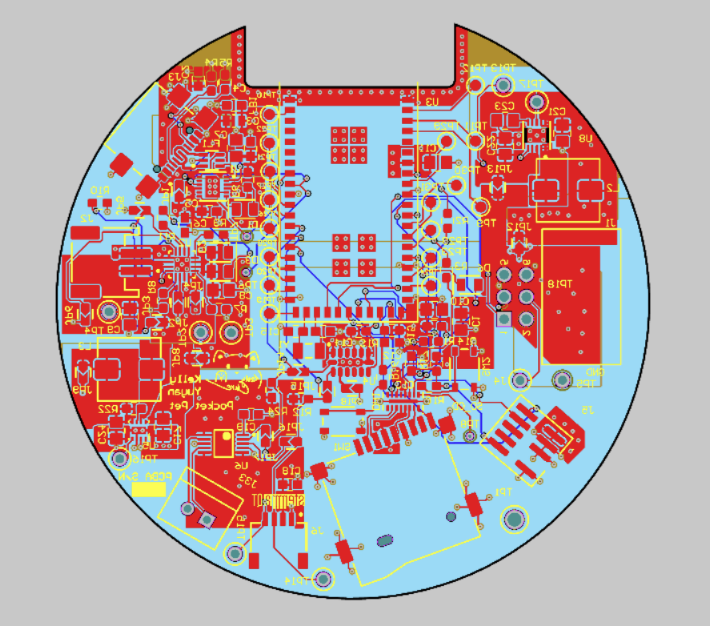
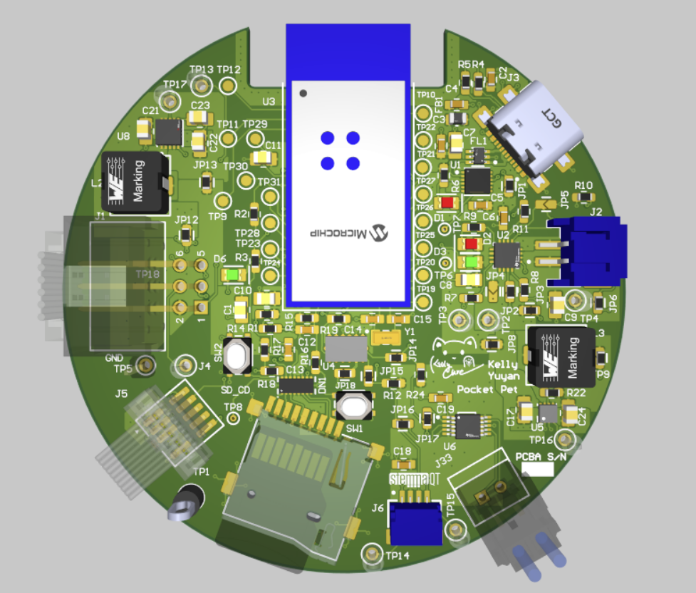
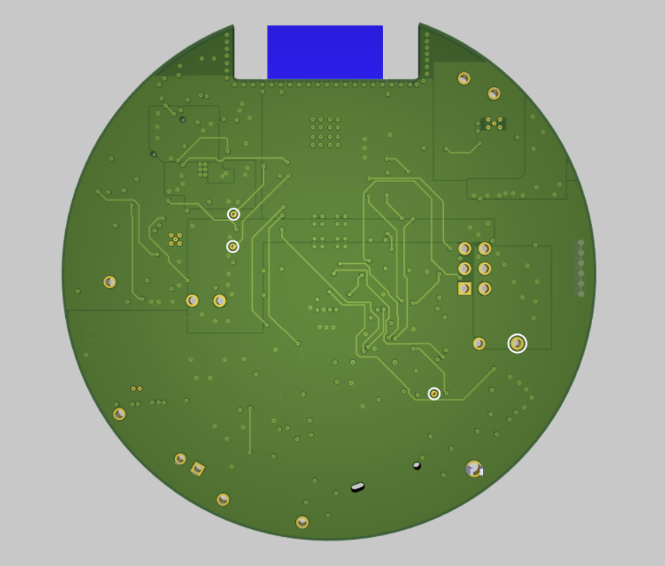
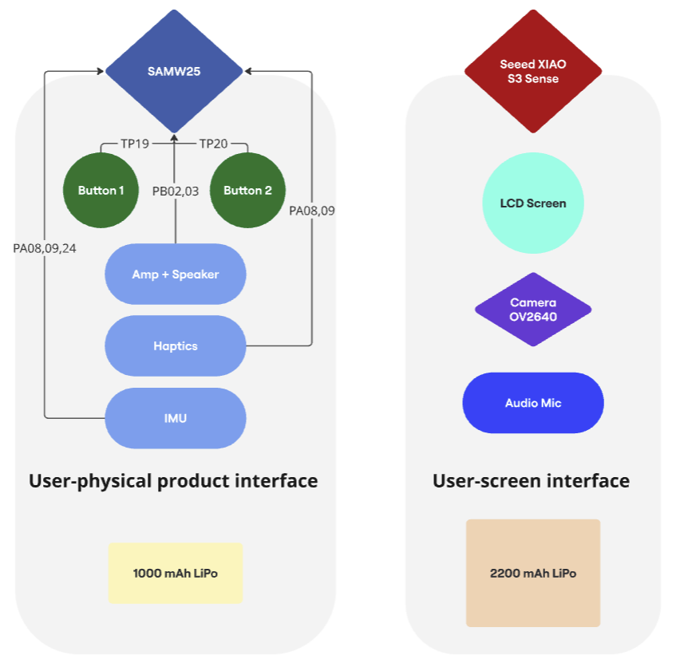

# a14g-final-submission

    * Team Number: T27
    * Team Name: Pocket Pet
    * Team Members: Yuyan Wang, Kelly LAI
    * Github Repository URL:[ese5160/a14g-final-submission-s25-t27-pocket-pet: ese5160s25-a14g-final-submission-s25-a14g-final-submission-skeleton created by GitHub Classroom](https://github.com/ese5160/a14g-final-submission-s25-t27-pocket-pet)
    * Description of test hardware: (development boards, sensors, actuators, laptop + OS, etc)

## 1. Video Presentation

## 2. Project Summary

### Device Description

The Pocket Pet is a palm-sized, AI-powered robotic cat designed for companionship, interaction, and productivity enhancement. It features expressive screen animations, haptic and audio feedback, and smart connectivity via Wi-Fi, Bluetooth, and NFC.

**Inspiration & Problem Solving:**

This project was inspired by the need for emotional companionship in compact living spaces and restrictions around pet ownership, especially for students or apartment dwellers. The device solves the problem by offering a digital pet that is intelligent, responsive, and portable.

**Internet Augmentation:**

The device uses the Internet to synchronize audio-visual and sensory feedback between two microcontrollers via Wi-Fi, access cloud-based AI models for interaction, and allow NFC-enabled smartphone interactions like checking the pet's digital ID and profile.

### Device Functionality

The Pocket Pet is built around two primary microcontrollers:

* **SAMW (Adafruit Audio FX + Amp)** : Manages sound playback, haptic feedback, and button responses.
* **Seeed Studio XIAO ESP32 S3 Sense** : Controls screen animations, microphone input, camera processing, and Wi-Fi/Bluetooth communication.

**Key Components:**

* **Sensors** : OV2640 camera, microphone, and IMU for gesture/motion detection
* **Actuators** : Mini metal speaker and vibration motor
* **Display** : Circular LCD (Seeed Studio round display)
* **Connectivity** : Wi-Fi (ESP32), BLE 5.0, NFC chip
* **Power** : Dual Li-Po batteries (1000mAh and 2200mAh)

**System-Level Block Diagram:**

### Challenges

**1. SAMW Instability During Hardware Transition:**

The SAMW (Adafruit Audio FX) board proved unreliable when moving from breadboard prototypes to soldered hardware. Its limited processing capability combined with sensitivity to physical connections made it unpredictable—sometimes functional, other times completely unresponsive depending on solder joint quality or mechanical stress.

**2. Memory Limitations on Seeed XIAO ESP32 S3:**

Implementing AI chat with ChatGPT, real-time photo capture, and video streaming placed a significant memory burden on the XIAO ESP32 S3. These tasks often led to out-of-memory errors and system crashes during runtime.

**Solutions:**

* For  **SAMW** , we improved hardware reliability by reinforcing solder joints and minimizing vibration or strain on the board. We also explored software-level error handling to maintain functionality when the board became unresponsive.
* For  **XIAO** , we introduced a clever workaround: loading a lightweight "blinking LED" task first to reset memory usage, then dynamically reloading the memory-heavy software. This sequence helped reinitialize resources cleanly and prevented memory errors from occurring.

### Prototype Learnings

**Iterative Design Was Key:**

Our prototype evolved significantly—from a basic rectangular shape to a refined circular design optimized for portability and user interaction. Each revision focused on testing joint alignment, fit tolerances, and ease of assembly, especially for magnetic attachments and internal components.

**Extensive Prototyping Process:**

We 3D-printed the enclosure *four times* using **PLA in the RPL (Rapid Prototyping Lab)** for quick iteration and form testing. To validate transparency and precision, we used **clear resin prints** at the school library  *twice* . We also tested a **flexible A80 filament version** to explore drop resistance and ergonomic comfort. This hands-on process allowed us to refine both mechanical fit and aesthetic finish.

**Lessons Learned:**

* PLA is great for fast, functional tests, but resin and flexible prints reveal more about real-world usability.
* Tolerances are critical—small dimensional changes can break alignment or prevent closure.
* Design simplification and modularity would reduce reprinting needs in future iterations.

**What We’d Do Differently:**

Begin with oversized tolerances, use flexible materials earlier, and design interlocking features that better handle component variability and user wear.

### Next Steps & Takeaways

**Next Steps:**

* **Improve Speaker Performance:** Optimize the internal case design to enhance acoustic resonance and airflow around the mini metal speaker for louder, clearer sound output.
* **Refine Power Management:** Implement smarter battery usage and auto-sleep logic to extend operational time.
* **Add Smart Behavior Profiles:** Introduce user-selectable modes (e.g., "Study Buddy," "Silent Mode") to tailor behavior and interactivity.
* **Explore SAMW Alternatives:** Evaluate more robust audio solutions to replace the unstable SAMW board in future revisions.
* **Finalize Enclosure:** Transition from prototyping materials to a durable, production-ready enclosure for field use.

**Course Takeaways:**

Through ESE5160, we learned how to transform a conceptual idea into a working IoT product. The course provided hands-on experience with sensor integration, embedded programming, wireless protocols, and iterative hardware design. Most importantly, it taught us how to troubleshoot across disciplines—electrical, mechanical, and software—and work through real-world prototyping constraints.

### **Project Links**

**Node-RED** URL:

PCBA Altium Designer: [https://upenn-eselabs.365.altium.com/designs/4EB67CF4-46FD-485B-AC5E-4C56645247D5](https://upenn-eselabs.365.altium.com/designs/4EB67CF4-46FD-485B-AC5E-4C56645247D5)

## 3. Hardware & Software Requirements

|          | ID     | Description                                     | Met? | Explanation                                                             |
| -------- | ------ | ----------------------------------------------- | ---- | ----------------------------------------------------------------------- |
| 0        | HRS 01 | SAMW handles sound, vibration, and button input | Yes  | Function achieved, but stability is inconsistent after soldering.       |
| 1        | HRS 02 | XIAO ESP32 S3 runs display, camera, mic, and AI | Yes  | XIAO successfully handled all assigned tasks including camera, mic, and |
| display. |        |                                                 |      |                                                                         |
| 2        | HRS 03 | Audio FX board stores and plays sound           | Yes  | Audio playback confirmed using Adafruit Audio FX board.                 |
| 3        | HRS 04 | Small speaker provides sound output             | Yes  | Speaker installed and produced sound as expected.                       |
| 4        | HRS 05 | Vibration motor for tactile feedback            | Yes  | Vibration motor responded correctly to interaction triggers.            |
| 5        | HRS 06 | Buttons used for interaction                    | Yes  | Both buttons were tested and functioned properly.                       |
| 6        | HRS 07 | Microphone captures voice for AI                | Yes  | Voice captured and processed through AI software.                       |
| 7        | HRS 08 | Circular LCD shows animations and status        | Yes  | Animations and UI displayed successfully on the circular screen.        |
| 8        | HRS 09 | Camera captures photos                          | Yes  | Photos captured via OV2640 were usable for interactions.                |
| 9        | HRS 10 | NFC chip for user info access                   | Yes  | NFC tag was readable by phone and returned expected data.               |
| 11       | HRS 12 | Bluetooth 5.0 for external control              | Yes  | Bluetooth successfully connected with external devices.                 |
| 12       | HRS 13 | Magnetic ring allows mode switching             | Yes  | Magnetic ring worked for mode switching and attachment.                 |
| 13       | HRS 14 | Two separate Li-Po batteries power MCUs         | Yes  | Two batteries powered their respective boards without issue.            |
| 14       | HRS 15 | IMU detects movement and gestures               | Yes  | IMU not functional due to SAMW instability.                             |
| 15       | HRS 16 | IMU communicates using I2C/SPI                  | Yes  | IMU communication not validated due to previous failure.                |
| 16       | SRS 01 | Wi-Fi used for syncing SAMW and XIAO            | No   | Wi-Fi communication was implemented, but performance was inconsistent.  |
| 17       | SRS 02 | LCD shows interactive visuals                   | Yes  | LCD displayed animations correctly.                                     |
| 18       | SRS 03 | Mic records voice for AI chat                   | Yes  | Microphone input successfully triggered AI responses.                   |
| 19       | SRS 04 | Camera captures user images                     | Yes  | Camera captured and processed images correctly.                         |
| 20       | SRS 05 | Vibration used for haptic feedback              | Yes  | Haptic motor triggered on interaction.                                  |
| 21       | SRS 06 | Speaker outputs AI-generated sounds             | Yes  | Sound was played reliably from the speaker.                             |
| 22       | SRS 07 | Buttons trigger actions                         | Yes  | Buttons were responsive in the software.                                |
| 23       | SRS 08 | NFC provides ID and profile on tap              | Yes  | NFC scan worked as intended to show digital profile.                    |
| 24       | SRS 09 | Ring allows desktop/iPhone/outdoor mode         | Yes  | Mode switching triggered correct behavior changes.                      |
| 25       | SRS 10 | Bluetooth enables external commands             | Yes  | BLE pairing and control through app was functional.                     |
| 26       | SRS 11 | Low battery triggers power-saving mode          | No   | Power-saving mode not implemented in firmware.                          |
| 27       | SRS 12 | IMU logs motion data                            | Yes  | Function achieved as intended.                                          |
| 28       | SRS 13 | Gestures (e.g. shake) trigger actions           | No   | Gesture recognition not implemented.                                    |

## 4. Project Photos & Screenshots

**Final Project:**

**Final Project, top:**

Final Project, side:

Final Project, bottom:

**PCBA, top:**

**PCBA, bottom:**

**Thermal camera images (Set current 0.360 A, 120% load):**

**The Altium Board design in 2D view**:

**The Altium Board design in 3D view**:

**Node-RED dashboard**:

**Node-RED backend**:

**Block diagram of your system**:

## Codebase

- A link to your final embedded C firmware codebases
- A link to your Node-RED dashboard code
- Links to any other software required for the functionality of your device
