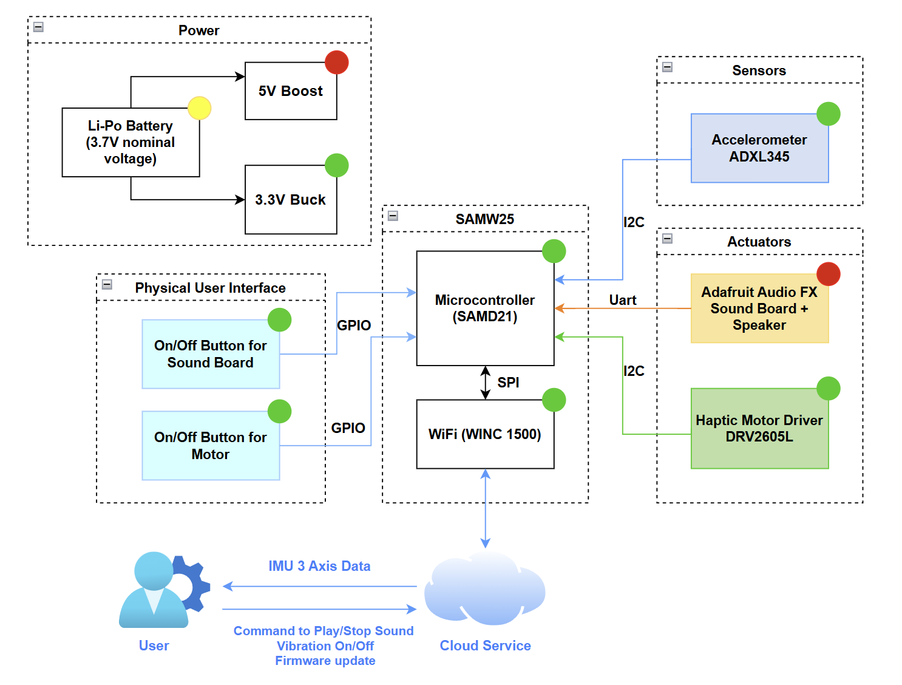

# a14g-final-submission

    * Team Number: T27
    * Team Name: Pocket Pet
    * Team Members: Yuyan Wang, Kelly LAI
    * Github Repository URL:[ese5160/a14g-final-submission-s25-t27-pocket-pet: ese5160s25-a14g-final-submission-s25-a14g-final-submission-skeleton created by GitHub Classroom](https://github.com/ese5160/a14g-final-submission-s25-t27-pocket-pet)
    * Description of test hardware: (development boards, sensors, actuators, laptop + OS, etc)

## 1. Video Presentation

## 2. Project Summary

### Device Description

**"Don’t miss out—bring home your Pocket Pet today and transform every moment with a playful, intelligent companion!"**

The Pocket Pet is a palm‑sized, AI‑driven robotic cat that offers companionship and interactive fun through expressive animations, ChatGPT‑powered conversation, and responsive sound and haptic feedback. With full internet connectivity, it supports remote control, over‑the‑air updates, cloud‑based AI services, multimedia streaming, and NFC‑enabled smartphone interactions.

**Inspiration & Problem Solving:**

This project was inspired by the need for emotional companionship in compact living spaces and restrictions around pet ownership, especially for students or apartment dwellers. The device solves the problem by offering a digital pet that is intelligent, responsive, and portable.

**Internet Augmentation:**

All of these features rely on an Internet connection: it enables remote control via a Node‑RED dashboard, allows firmware updates, provides access to cloud‑based AI models for interaction, and supports NFC‑enabled smartphone functions such as checking the pet’s digital ID and profile.

### Device Functionality

The Pocket Pet’s motion sensors respond to your movements with seven unique sound effects and five distinct vibration patterns, while its vibrant OLED screen brings the cat to life with expressive animations and seamless ChatGPT‑powered conversation; Users can also snap photos or stream live video on demand, and thanks to built‑in Wi‑Fi, the device supports over‑the‑air firmware updates and full remote control via a Node‑RED dashboard.

The Pocket Pet is built around two primary microcontrollers:

* **SAMW25**: Manages motion detection via the ADXL345 accelerometer; sound playback through the Adafruit Audio FX sound board and speaker; haptic vibration feedback using the DRV2605L motor driver and motor; button inputs; Node‑RED–based remote control; and over‑the‑air firmware updates.
* **Seeed Studio XIAO ESP32 S3 Sense**: Handles LCD screen animations; microphone input; camera capture and live‑video streaming; and Wi‑Fi–based interfacing with cloud AI models.

**Key Components**

* **Sensors**: Accelerometer ADXL345, OV2640 camera (built in Xiao ESP32 S3 Sense), microphone (built in XIAO ESP32 S3 Sense)
* **Actuators**: Adafruit Audio FX Sound Board with mini metal speaker, haptic motor driver DRV2605L + vibration motor, Seeed Studio round display
* **Connectivity** : Wi-Fi (SAMW25 & Xiao ESP32S3 Sense), BLE 5.0, NFC chip
* **Power** : Dual Li-Po batteries (2000mAh and 2200mAh)

**System-Level Block Diagram:**

### Challenges

**1). PCB Layout-limited area to arrange lots of components**

One of our goals was to make the product as small and circular as possible, so fitting so many components into a limited, round PCB area presented a major challenge.
**Solution:**

We iterated the layout numerous times to ensure each module occupied its optimal position, making efficient use of every available millimeter.

**2). Adafruit Audio FX Sound Board Instability During Hardware Transition:**

The Adafruit Audio FX Sound Board proved unreliable when transitioning from breadboard prototypes to soldered hardware. Its limited processing power and sensitivity to physical connections made performance unpredictable: sometimes it worked perfectly, other times the speaker was completely unresponsive, depending on solder‑joint quality or mechanical stress.

**Solution:**

We first ran the test code to determine why the speaker produced no sound and found that initialization was successful; the problem likely due to the solder joints of the power section. We then improved hardware reliability by reinforcing those joints and minimizing vibration or strain on the board.

**3). Memory Limitations on Seeed XIAO ESP32 S3 Sense:**

Implementing AI chat with ChatGPT, real-time photo capture, and video streaming placed a significant memory burden on the XIAO ESP32 S3. These tasks often led to out-of-memory errors and system crashes during runtime.

**Solution:**

We introduced a clever workaround: loading a lightweight "blinking LED" task first to reset memory usage, then dynamically reloading the memory-heavy software. This sequence helped reinitialize resources cleanly and prevented memory errors from occurring.

### Prototype Learnings

For PCB prototype, we iterated the layout to ensure each module has the best layout with each component. We put the same power module close to each other and close to the power. We strictly follow the datasheet to draw the power module, ensure it's in correct and stable layout. We double check every module to prevent any mistake or dangerous point that could lead to manufacture issue.

In the testing process, we learned that to scale our approach from individual components to the complete system. We began by evaluating each power regulator—first the buck converter, then the boosrt converter—and, once both were confirmed to deliver the correct voltages, we verified the functionality of the entire power module. Our PCB works perfectly thanks to our careful design.

If we had the chance to redesign it, we would place the 5 V module closer to the battery‑charger section to avoid any potential issues.

For 3D mode, our prototype evolved significantly—from a basic rectangular shape to a refined circular design optimized for portability and user interaction. Each revision focused on testing joint alignment, fit tolerances, and ease of assembly, especially for magnetic attachments and internal components.

**Extensive Prototyping Process:**

We 3D-printed the enclosure *four times* using **PLA in the RPL (Rapid Prototyping Lab)** for quick iteration and form testing. To validate transparency and precision, we used **clear resin prints** at the school library  *twice* . We also tested a **flexible A80 filament version** to explore drop resistance and ergonomic comfort. This hands-on process allowed us to refine both mechanical fit and aesthetic finish.

**Lessons Learned:**

* PLA is great for fast, functional tests, but resin and flexible prints reveal more about real-world usability.
* Tolerances are critical—small dimensional changes can break alignment or prevent closure.
* Design simplification and modularity would reduce reprinting needs in future iterations.

**What We Would Do Differently:**

Begin with oversized tolerances, use flexible materials earlier, and design interlocking features that better handle component variability and user wear.

### Next Steps & Takeaways

**Next Steps:**

* **Improve Speaker Performance:** Optimize the internal case design to enhance acoustic resonance and airflow around the mini metal speaker for louder, clearer sound output.
* **Refine Power Management:** Implement smarter battery usage and auto-sleep logic to extend operational time.
* **Add Smart Behavior Profiles:** Introduce user-selectable modes (e.g., "Study Buddy," "Silent Mode") to tailor behavior and interactivity.
* **Explore SAMW Alternatives:** Evaluate more robust audio solutions to replace the unstable SAMW25 board in future revisions.
* **Finalize Enclosure:** Transition from prototyping materials to a durable, production-ready enclosure for field use.
* **Face Detection**: Add face detection function to Xiao ESP32S3 Sense board when using camera module.

**Course Takeaways:**

Through ESE5160, we learned how to transform a conceptual idea into a working IoT product. The course provided hands-on experience with sensor integration, embedded programming, wireless protocols, and iterative hardware design. Most importantly, it taught us how to troubleshoot across disciplines—electrical, mechanical, and software—and work through real-world prototyping constraints.

A key takeaway from this course was gaining hands‑on expertise in Altium Designer—an industry‑standard PCB tool—which enabled us to go from schematic capture and layout design all the way through to generating manufacturing files. Equally valuable was our deep dive into FreeRTOS, where we learned to structure real‑time applications by creating and managing tasks, implementing inter‑task communication, and using semaphores and mutexes to build efficient, reliable embedded software.

### **Project Links**

**Node-RED** URL:

Dashboard: http://20.185.221.248:1880/ui/#!/0?socketid=D7hYEW6I2cqlh01MAAAf

Backend: http://20.185.221.248:1880/#flow/a7c0786199e46121

PCBA Altium Designer: [https://upenn-eselabs.365.altium.com/designs/4EB67CF4-46FD-485B-AC5E-4C56645247D5](https://upenn-eselabs.365.altium.com/designs/4EB67CF4-46FD-485B-AC5E-4C56645247D5)

## 3. Hardware & Software Requirements

|          | ID     | Description                                       | Met? | Explanation                                                                   |
| -------- | ------ | ------------------------------------------------- | ---- | ----------------------------------------------------------------------------- |
| 0        | HRS 01 | SAMW25 handles sound, vibration, and button input | Yes  | Function achieved, but stability is inconsistent after soldering.             |
| 1        | HRS 02 | XIAO ESP32 S3 runs display, camera, mic, and AI   | Yes  | XIAO successfully handled all assigned tasks including camera, mic, and       |
| display. |        |                                                   |      |                                                                               |
| 2        | HRS 03 | Audio FX board stores and plays sound             | Yes  | Audio playback confirmed using Adafruit Audio FX board.                       |
| 3        | HRS 04 | Small speaker provides sound output               | Yes  | Speaker installed and produced sound as expected.                             |
| 4        | HRS 05 | Vibration motor for haptic driver feedback       | Yes  | Vibration motor responded correctly to interaction triggers.                  |
| 5        | HRS 06 | Buttons used for interaction                      | Yes  | Both buttons were tested and functioned properly.                             |
| 6        | HRS 07 | Microphone captures voice for AI                  | Yes  | Voice captured and processed through AI software.                             |
| 7        | HRS 08 | Circular LCD shows animations and status          | Yes  | Animations and UI displayed successfully on the circular screen.              |
| 8        | HRS 09 | Camera captures photos                            | Yes  | Photos captured via OV2640 were usable for interactions.                      |
| 9        | HRS 10 | NFC chip for user info access                     | Yes  | NFC tag was readable by phone and returned expected data.                     |
| 11       | HRS 11 | Bluetooth 5.0 for external control                | Yes  | Bluetooth successfully connected with external devices.                       |
| 12       | HRS 12 | Magnetic ring allows mode switching               | Yes  | Magnetic ring worked for mode switching and attachment.                       |
| 13       | HRS 13 | Two separate Li-Po batteries power MCUs           | Yes  | Two batteries powered their respective boards without issue.                  |
| 14       | HRS 14 | IMU detects movement and gestures                 | Yes  | IMU precisely detect movement and generate 3 axis data.                       |
| 15       | HRS 15 | IMU communicates using I2C                        | Yes  | IMU ADXL345 successfully communicate with SAMW25 through I2C.                 |
| 16       | SRS 01 | Wi-Fi used for SAMW25 and Xiao ESP32S3 Sense     | Yes  | SAMW25 use Wi-Fi to achieve Node-RED control and Xiao use it for AI model. . |
| 17       | SRS 02 | LCD shows interactive visuals                     | Yes  | LCD displayed animations correctly.                                           |
| 18       | SRS 03 | Mic records voice for AI chat                     | Yes  | Microphone input successfully triggered AI responses.                         |
| 19       | SRS 04 | Camera captures user images                       | Yes  | Camera captured and processed images correctly.                               |
| 20       | SRS 05 | Vibration used for haptic feedback                | Yes  | Haptic motor triggered on interaction.                                        |
| 21       | SRS 06 | Speaker outputs AI-generated sounds               | Yes  | Sound was played reliably from the speaker.                                   |
| 22       | SRS 07 | Buttons trigger actions                           | Yes  | Buttons were responsive in the software.                                      |
| 23       | SRS 08 | NFC provides ID and profile on tap                | Yes  | NFC scan worked as intended to show digital profile.                          |
| 24       | SRS 09 | Ring allows desktop/iPhone/outdoor mode           | Yes  | Mode switching triggered correct behavior changes.                            |
| 25       | SRS 10 | Bluetooth enables external commands               | Yes  | BLE pairing and control through app was functional.                           |
| 26       | SRS 11 | Low battery triggers power-saving mode            | No   | Power-saving mode not implemented in firmware.                                |
| 27       | SRS 12 | IMU logs motion data                              | Yes  | Function achieved as intended.                                                |
| 28       | SRS 13 | Gestures (e.g. shake) trigger actions             | No   | Gesture recognition not implemented.                                          |

## 4. Project Photos & Screenshots

**Final Project:**

**PCBA, top:**

**PCBA, bottom:**

**Thermal camera images (Set current 0.360 A, 120% load):**

**The Altium Board design in 2D view**:

**The Altium Board design in 3D view**:

**Node-RED dashboard**:

**Node-RED backend**:

**Block diagram of our system**:

## Codebase

- A link to your final embedded C firmware codebases

  https://github.com/ese5160/final-project-t27-pocket-pet
- A link to your Node-RED dashboard code

  https://github.com/ese5160/a14g-final-submission-s25-t27-pocket-pet/tree/main/Node-RED
- Links to any other software required for the functionality of your device
